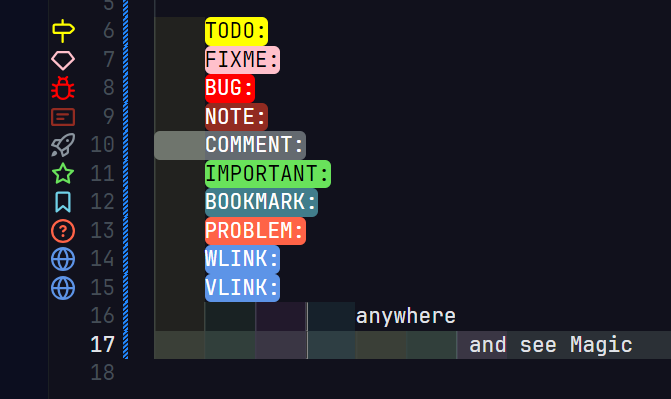

## 15-07-2024
after paste my json code then must install all extension.
Special customization is Todo Tree:
after install todo tree and paste my json code then write 

    TODO:
    FIXME:
    BUG:
    NOTE:
    COMMENT:
    IMPORTANT:
    BOOKMARK:
    PROBLEM:
    WLINK:
    VLINK:
                anywhere
                         and see Magic

