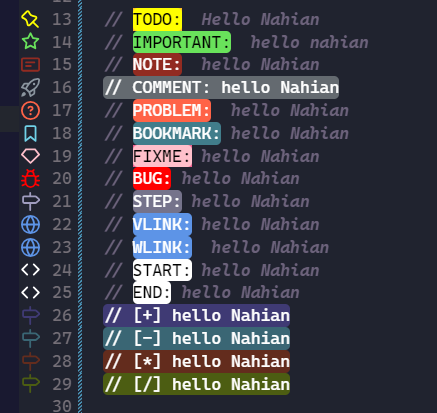

## last update 01-02-2025
after paste my json code then must install all extension.
Special customization is Todo Tree:
after install todo tree and paste my json code then write 

    TODO:
    FIXME:
    BUG:
    NOTE:
    COMMENT:
    IMPORTANT:
    BOOKMARK:
    PROBLEM:
    WLINK:
    VLINK:
    STEP:
    START:
    END:
    [+]
    [-]
    [*]
    [/]
                anywhere
                         and see Magic

